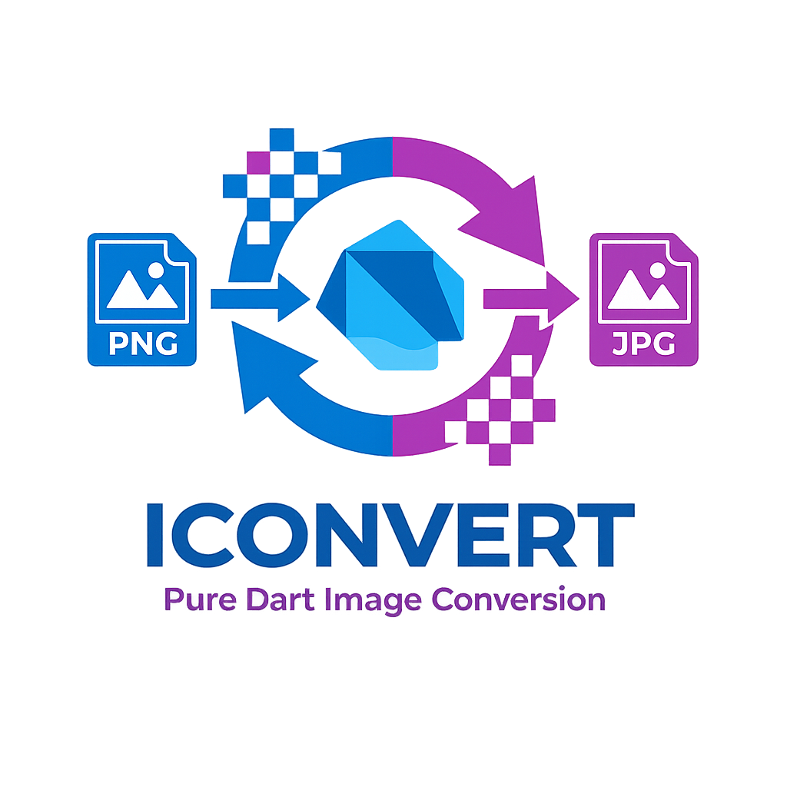

# iconvert

A pure Dart image converter library with support for multiple image formats. Convert, resize, and batch process images with ease.

## Features

- **Multi-format support**: Convert between PNG, JPG, JPEG, BMP, GIF, TIFF, and ICO formats
- **Synchronous and asynchronous APIs**: Choose between blocking and non-blocking operations
- **Image resizing**: Resize images with optional aspect ratio maintenance
- **Batch processing**: Convert multiple images in a directory with a single call
- **Quality control**: Adjust JPEG compression quality
- **Transparency handling**: Preserve or customize transparency for different formats
- **Pure Dart implementation**: No native dependencies, works across all Dart platforms

## Getting Started

### Installation

Add to your `pubspec.yaml`:

```yaml
dependencies:
  iconvert: ^0.0.1
```

### Basic Usage

```dart
import 'package:iconvert/iconvert.dart';

void main() async {
  const converter = ImageConverter();
  
  // Convert a single file
  await converter.convertFile(
    inputPath: 'photo.png',
    outputPath: 'photo.jpg',
  );
}
```

### Convert with Options

```dart
final options = ConvertOptions(
  width: 800,
  height: 600,
  quality: 85,
  maintainAspectRatio: true,
);

await converter.convertFile(
  inputPath: 'original.png',
  outputPath: 'resized.jpg',
  options: options,
);
```

### Batch Conversion

```dart
final count = await converter.batchConvert(
  inputDirectory: './images',
  outputDirectory: './output',
  outputFormat: ImageFormat.jpg,
  options: const ConvertOptions(quality: 80),
);

print('Converted $count images');
```

### Synchronous Operations

```dart
// If you prefer synchronous operations
converter.convertFileSync(
  inputPath: 'photo.png',
  outputPath: 'photo.jpg',
);
```

## Examples

Check the `/example` folder for complete examples:
- `example_simple_convert.dart` - Basic single file conversion
- `example_with_options.dart` - Conversion with custom options
- `example_batch_convert.dart` - Batch processing multiple images
- `example_interactive.dart` - Interactive CLI converter tool

## Supported Formats

| Format | Read | Write | Transparency |
|--------|------|-------|--------------|
| PNG    | ✓    | ✓     | Yes          |
| JPG    | ✓    | ✓     | No           |
| JPEG   | ✓    | ✓     | No           |
| BMP    | ✓    | ✓     | No           |
| GIF    | ✓    | ✓     | Yes          |
| TIFF   | ✓    | ✓     | No           |
| ICO    | ✓    | ✓     | Yes          |

## API Reference

### ImageConverter

Main class for image conversion operations.

```dart
const converter = ImageConverter();

// Convert image bytes
Uint8List result = converter.convert(
  inputBytes: imageBytes,
  outputFormat: ImageFormat.jpg,
  options: const ConvertOptions(),
);

// Convert file asynchronously
await converter.convertFile(
  inputPath: 'input.png',
  outputPath: 'output.jpg',
);

// Convert file synchronously
converter.convertFileSync(
  inputPath: 'input.png',
  outputPath: 'output.jpg',
);

// Batch convert directory
int count = await converter.batchConvert(
  inputDirectory: 'images/',
  outputDirectory: 'output/',
  outputFormat: ImageFormat.jpg,
);
```

### ConvertOptions

Configuration for conversion operations.

```dart
const options = ConvertOptions(
  width: 800,              // Target width (optional)
  height: 600,             // Target height (optional)
  quality: 85,             // JPEG quality 1-100 (default: 90)
  maintainAspectRatio: true, // Maintain aspect when resizing
  backgroundColor: RgbColor.white, // Background for transparency
);
```

### ImageFormat

Enum for supported image formats.

```dart
ImageFormat.png
ImageFormat.jpg
ImageFormat.jpeg
ImageFormat.bmp
ImageFormat.gif
ImageFormat.tiff
ImageFormat.ico
```

## Error Handling

```dart
try {
  await converter.convertFile(
    inputPath: 'photo.png',
    outputPath: 'photo.jpg',
  );
} on ImageConvertException catch (e) {
  print('Conversion failed: $e');
}
```

## Testing

Run tests with:

```bash
dart test
```

All 65+ tests pass including:
- Format conversion matrix tests
- Transparency handling
- Batch processing
- Error handling
- Integration tests

## Performance

- Lightweight: Pure Dart implementation with minimal dependencies
- Efficient: Supports both sync and async operations
- Scalable: Batch processing for handling multiple images

## License

MIT License
